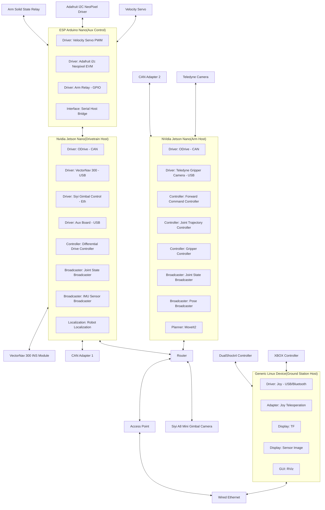

# Sparky CIRC 2026 

This is the CIRC competition ready repository for UWRobotics Season 2026. This
repository contains code needed for the groundstation, drivetrain and other
related modules.

## TODO

- [ ] VCAN ODrive Support
- [x] Ros_Odrive rover integration
- [ ] VN-300 Driver
- [ ] IMU Drift Compensation
- [ ] Camera Ethernet
- [ ] Back-up RF
- [ ] Unit test
- [ ] Application test

<!--
TODO: Add System Requirements
-->

# Architecture Design



<!--
TODO: Add Detailed Design for each Module 
  Notes:
    - One D.D. for a ground E.g Controller Group
-->

<!--
TODO: Add Unit Tests List
  Notes:
    - Only Testing Custom Feature
-->

<!--
TODO: Add Qualification Tests Lists
  Feature: 
    - Manual Testing
    - Automated Testing
    - Checklists
    - SOPs
-->

## Project Structure
```
./
├── Dockerfile              # Docker image definition
├── docker-compose.yml      # Container orchestration (base, works on Ubuntu)
├── scripts/                # Shell scripts
│   ├── setup.sh            # Host-side: detects UID/GID, prepares .env
│   ├── docker-entrypoint.sh# Container startup script
│   └── build.sh            # Build script for ROS2 workspace
├── src/                    # ROS2 source code
└── README.md               # This file
```

### Prerequisites

```bash
# Setup the ENV
./scripts/setup.sh
```

**Linux Only: Grant Docker access to your X server:**
```bash
xhost +local:docker
```

### Setup Docker

```bash
# In Project Root
docker compose build
docker compose up -d

# Enter the docker container
docker compose exec ros2-dev bash

# Remove the docker container
docker compose down
```

### ROS Package

```bash
# Build the ROS Package
./build.sh

# Source the ENV
source install/setup.bash

# Launch
ros2 launch <ROS_PKG> <ROS_LAUNCH> 
```

---

### Debug Info

#### No Gui issue

**Verify `DISPLAY` is set:**
```bash
echo $DISPLAY   # should print :0 or :1
```
If empty, set it manually:
```bash
export DISPLAY=:0
```

---

## License

This project is licensed under the MIT License - see the [LICENSE](LICENSE) file for details.

Copyright (c) 2026 UWRobotics.

This repository bundles third-party components under their own licenses (see [NOTICE](NOTICE)):
- `src/ros_odrive` (submodule) — MIT, © ODrive Robotics (see `src/ros_odrive/LICENSE`).
- `src/dualshock4_teleop` (akros2_teleop, submodule) — Apache-2.0, © 2023 Aditya Kamath (see `src/dualshock4_teleop/LICENSE`).
- `src/akros2_msgs` (submodule) — Apache-2.0, © 2023 Aditya Kamath (see `src/akros2_msgs/LICENSE`).
