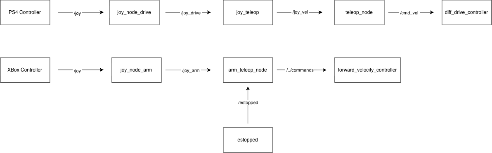

### Drivetrain pipeline

**joy_node_drive** — `joy` / `joy_node`. Reads the PS4 controller.
- Publishes: `/joy_drive` [`sensor_msgs/msg/Joy`]
- Parameters: `device_name: "Wireless Controller"`, `deadzone: 0.1`, `autorepeat_rate: 20.0`,
  `coalesce_interval: 0.01`

**joy_teleop** — `teleop_twist_joy` / `teleop_node`. Converts joystick
axes into a velocity command.
- Subscribes: `/joy_drive` [`sensor_msgs/msg/Joy`]
- Publishes: `/joy_vel` [`geometry_msgs/msg/Twist`]
- Parameters: `config/<joy_config>_twist_config.yaml` (axis mapping,
  scale_linear, scale_angular, turbo)

**forward_velocity_controller** — stock ros2_control
`forward_command_controller/ForwardCommandController`, configured for
the 6 arm joints (`Joint_1`–`Joint_6`) with `interface_name: velocity`.
Consumes `/forward_velocity_controller/commands`
[`std_msgs/msg/Float64MultiArray`] from `arm_teleop_node`.

### Arm pipeline

**joy_node_arm** — `joy` / `joy_node`. Reads the Xbox controller.
- Publishes: `/joy_arm` [`sensor_msgs/msg/Joy`]
- Parameters: `device_name: "Generic X-Box pad"` (verified),
  `deadzone: 0.1`, `autorepeat_rate: 20.0`, `coalesce_interval: 0.01`

**arm_teleop_node** — `arm_teleop` / `arm_teleop_node`. Maps joystick
input to arm joint velocities, with an e-stop safety cutoff.
- Subscribes:
  - `/joy_arm` [`sensor_msgs/msg/Joy`] (code subscribes to `/joy`,
    remapped at launch)
  - `/estopped` [`arm_teleop_messages/msg/EstopStatus`] — latched
    (transient-local), so the node always has the current e-stop state.
    Publishes zero velocities when e-stopped.
- Publishes: `/forward_velocity_controller/commands`
  [`std_msgs/msg/Float64MultiArray`]

*(→ /forward_velocity_controller/commands feeds the arm's ros2_control
controller, documented separately)*

Note: `joy_node_drive` and `joy_node_arm` run simultaneously,
distinguished by `device_name` (not index), so two physical
controllers can be used at once.