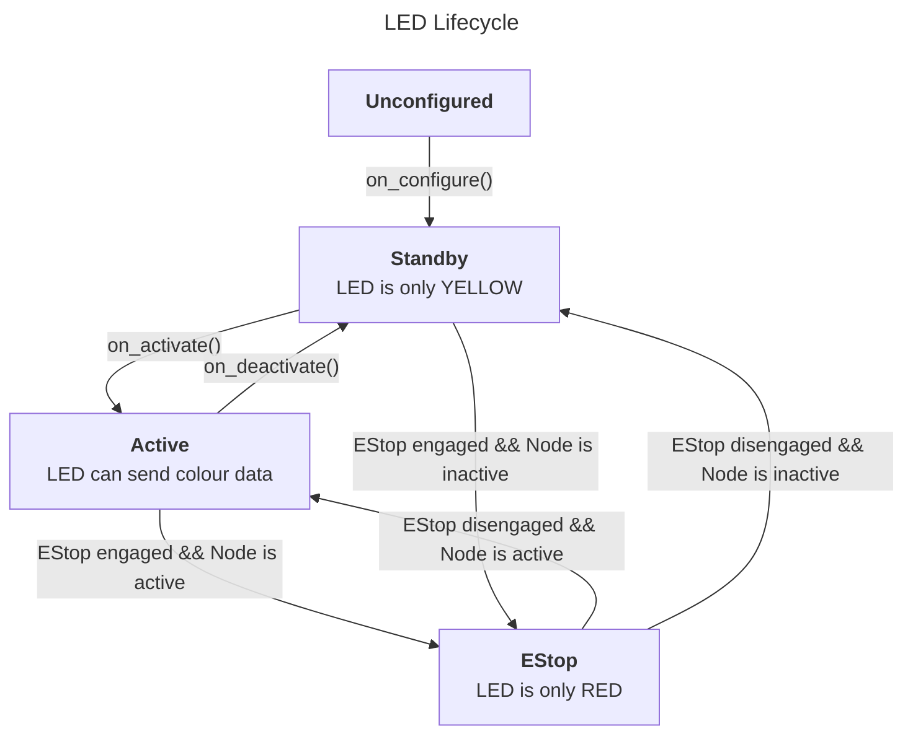

```mermaid
---
title: LED Lifecycle
---
flowchart TD
    Unconfigured["`**Unconfigured**`"]
    Standby["`**Standby**
    LED is only YELLOW`"]
    Active["`**Active**
    LED can send colour data`"]
    EStop["`**EStop**
    LED is only RED`"]

    Unconfigured-- on_configure() -->Standby

    Standby-- on_activate() -->Active
    Active-- on_deactivate() -->Standby

    Active-- EStop engaged && Node is active -->EStop
    EStop-- EStop disengaged && Node is active -->Active
    Standby-- EStop engaged && Node is inactive -->EStop
    EStop-- EStop disengaged && Node is inactive -->Standby
```