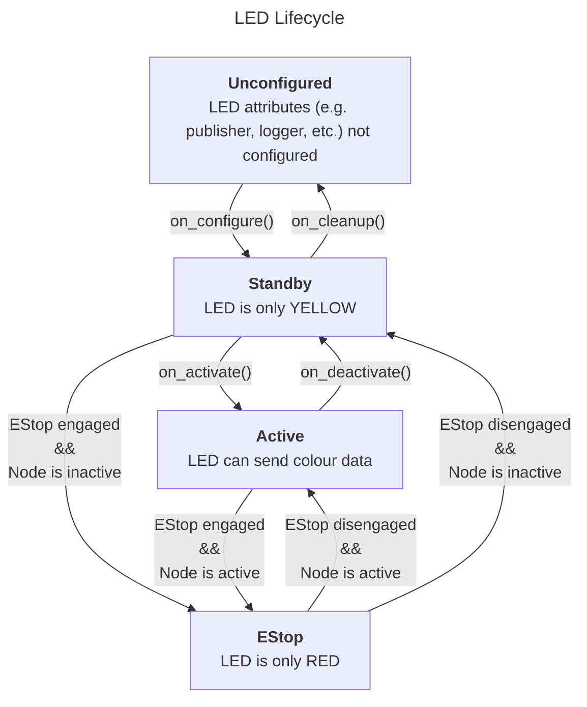

```mermaid
---
title: LED Lifecycle
---
flowchart TD
    %% Nodes
    Unconfigured["`**Unconfigured**<br>LED attributes (e.g. publisher, logger, etc.) not configured`"]
    Standby["`**Standby**<br>LED is only YELLOW`"]
    Active["`**Active**<br>LED can send colour data`"]
    EStop["`**EStop**<br>LED is only RED`"]

    %% Flowchart
    Unconfigured -->|"on_configure()"| Standby
    Standby -->|"on_cleanup()"| Unconfigured

    Standby -->|"on_activate()"| Active
    Active -->|"on_deactivate()"| Standby

    %% EStop
    Standby -->|"EStop engaged<br>&&<br>Node is inactive"| EStop
    Active -->|"EStop engaged<br>&&<br>Node is active"| EStop
    EStop -->|"EStop disengaged<br>&&<br>Node is active"| Active
    EStop -->|"EStop disengaged<br>&&<br>Node is inactive"| Standby
```