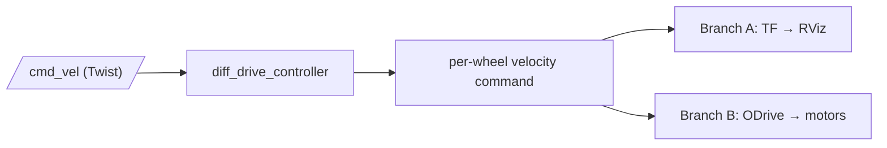

# sparky_description

Hardware description package for UWRobotics Sparky 2026.
This package was derived from SolidWorks exporter package
and ported over to ROS2 Humble.

## TODO:

- [ ] Cascade Controller: <POS> -> Diff Controller<VEL>
- [ ] Support to Gazebo Simulation

## Detailed Design

`cmd_vel` (Twist) drives `diff_drive_controller`, which turns it into a
per-wheel velocity command inside `ros2_control`. From there it splits into
two independent branches: one that ends up on screen in RViz (via TF), and
one that ends up as motion on the real rover (via the ODrive plugin).



## Known Limitation

**Issue 1: Observe `wheel` drifting away from `base_link`**

RViz depends on TF frame posts. If the current system
contains high latency the RViz might display TF computed from
few frames before.

## GUI Visualization Demo 

```bash
./build.sh

source install/setup.bash

ros2 launch sparky_description display.launch.py
ros2 launch sparky_description gazebo.launch.py
```

### Drive control (cmd_vel → ros2_control → RViz)

```bash
ros2 launch sparky_description control.launch.py
ros2 topic pub /cmd_vel geometry_msgs/msg/Twist '{linear: {x: 0.3}, angular: {z: 0.4}}'
```

## Legacy ROS 1 (Noetic)

The original catkin/Noetic version of this package is preserved under
[`archive/`](archive/). See [`archive/README.md`](archive/README.md) for the
ROS 1 build and validation steps.